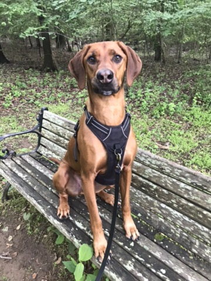
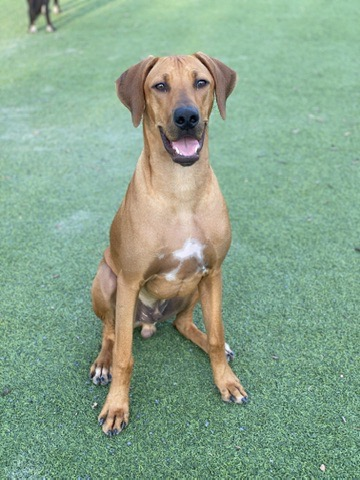

# Toast vs. Duncan: A Dog Image Classifier

This project trains a binary image classifier to distinguish between my two dogs, Toast and Duncan, 
who are the same breed and look remarkably similar. It's a fun, personal project designed to demonstrate 
practical machine learning skills, including image preprocessing, transfer learning, and evaluation using PyTorch.

| Toast                          | Duncan                          |
|--------------------------------|---------------------------------|
|          |          |

## Approach

- Used a **pretrained ResNet-18** model from `torchvision.models`
- **Froze all convolutional layers**, retrained only the final classifier
- Applied **standard ImageNet normalization**
- Trained on a **custom dataset** of Toast and Duncan images
- Used **transfer learning** to achieve high accuracy on limited data
- Included **early stopping** and **learning rate scheduling** for stability

## Evaluation

- Achieved **92% accuracy** on test set
- Visualized predictions to compare true and predicted labels
